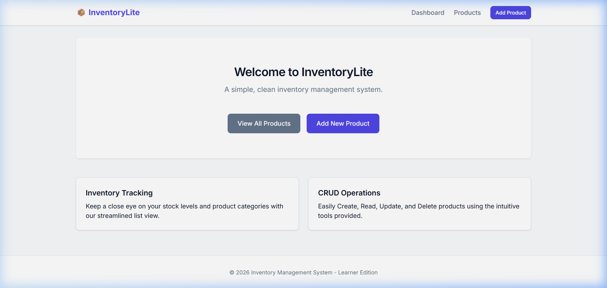

# Inventory Management System - Learner Edition

A cleanly architected, responsive, and easy-to-understand Inventory Management System built entirely with Flask, SQLAlchemy, HTML, and CSS. This repo acts as a perfect baseline for learners looking to jump into web development without the overhead of learning massive UI frameworks or monolithic JavaScript structures.

## System Overview
- **Backend**: Python 3.11 with standard routing in `app.py`.
- **Database**: SQLite using `Flask-SQLAlchemy`.
- **Frontend**: Standard Jinja2 template rendering.
- **Styling**: `style.css` utilizing modern web-design features like CSS Variables, Grid, and Flexbox for complete responsiveness and aesthetics (No Bootstrap/Tailwind required).



## Getting Started

### 1. Prerequisites
Ensure you have Python 3.9+ installed.

### 2. Installation
Create a virtual environment (optional but recommended) and install dependencies.

```bash
# Create and activate virtual environment
python -m venv .venv
.\.venv\Scripts\activate

# Install the required packages
pip install -r requirements.txt
```

### 3. Initialize the Database
We have provided a comprehensive mock database script (`seed.py`). This script leverages the Flask application context to safely setup and populate the necessary tables with starting data.

```bash
python seed.py
```

### 4. Run the Application
Finally, start up the Flask development server:

```bash
python app.py
```

Navigate to `http://127.0.0.1:5002` in your browser. *(Note: Port configured to 5002 to avoid standard collision issues).*

## Core Capabilities

- **Inventory Dashboard**: A modern landing menu to view current assets and metrics.
- **Create Products**: Insert new inventory items including Name, Category, Description, Price, and Stock Quantity.
- **Update Products**: Easy data manipulation for when numbers need an adjustment.
- **Delete Options**: Remove stale stock from the system entirely.
- **Inventory Logs**: Responsive table-views to categorize, display stock-level indicators (low-stock red highlights), and sort financial values.

## Learning Objectives

If you are examining this codebase, pay close attention to:
- **`app.py` structure**: Look at how the `@app.route` decorators bind Python functions to website URLs. Notice the `with app.app_context(): db.create_all()` pattern.
- **`templates/base.html` architecture**: Master how `` reduces repeated boilerplate.
- **Custom `style.css`**: See how Variables (`:root`) govern the entire visual system gracefully.

## Customization
We rely heavily on CSS Variables. If you want to change the primary brand color to Red instead of Indigo, simply open `static/style.css` and modify:

```css
:root {
  --primary-color: #ef4444; 
  --primary-hover: #dc2626;
}
```

Everything else will adapt seamlessly!
